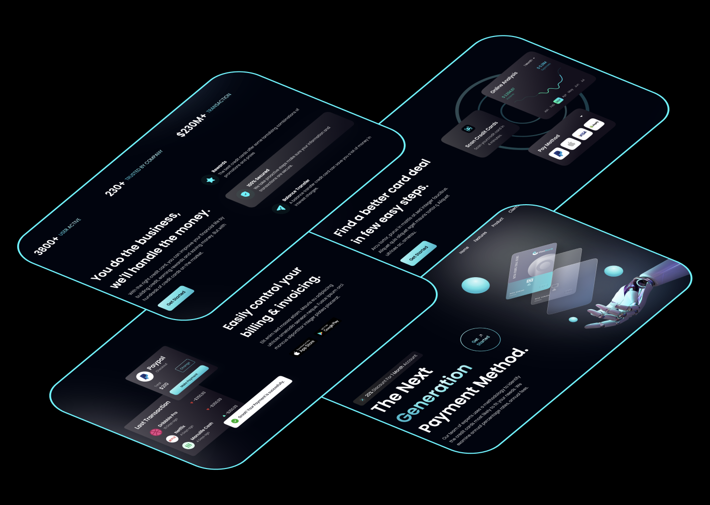

# Getting Started with React app

## About

React portfolio — seamless design, showcasing projects and skills.

## Clone the Repository:

### `git clone https://github.com/igor-mlv/example-of-responsive-react-app.git`

## Install Dependencies:

### `npm install`

## Run the App:

### `npm run dev`

## Open in Your Browser:

Open http://localhost:5173 in your web browser.

## Technologies Used

React.js
JavaScript
HTML/CSS
Vite

## Contributing

Feel free to contribute, report issues, or suggest improvements!

Happy coding! 🚀

Design from https://www.jsmastery.pro
